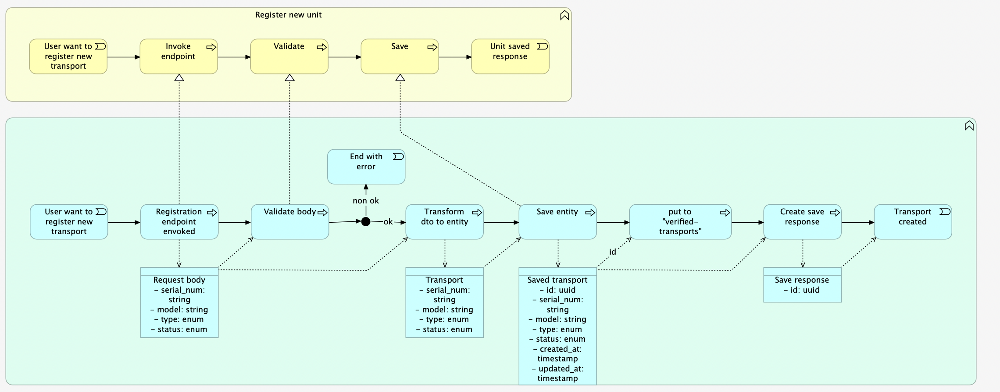
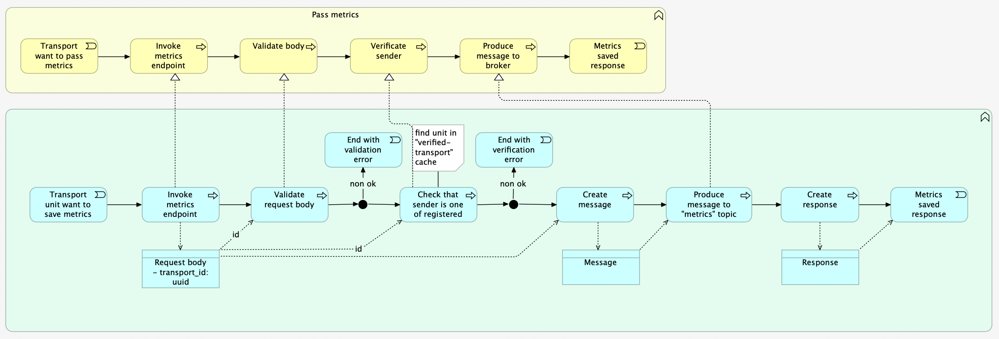
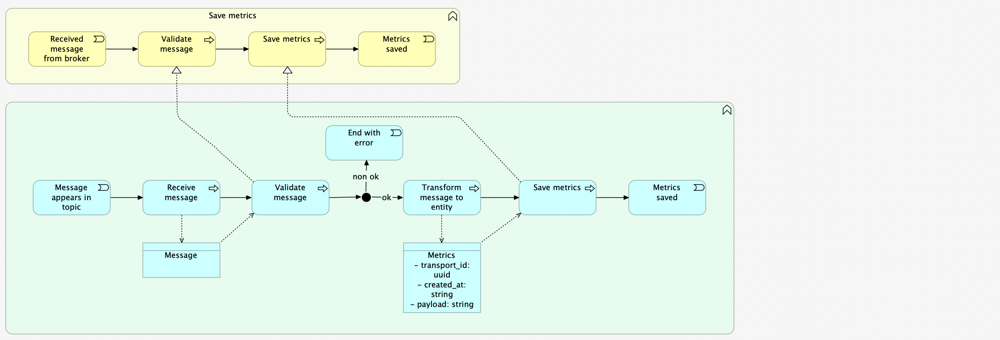
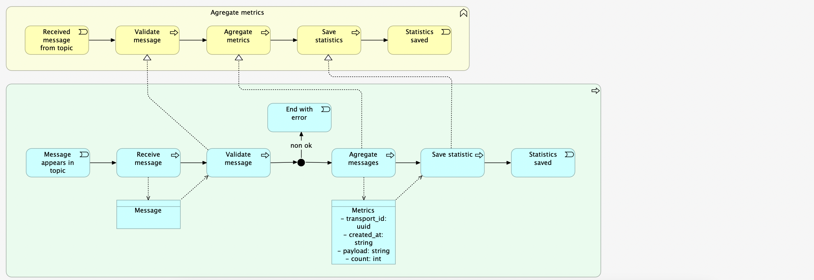

## Driverless transport

> This pet project is aimed to practice new approaches and technologies as well as to demonstrate code-style.
>
> Indeed, this is just my hobby with useful side effect.

The main business idea is implementation IoT application representing by driver less transport and metrics passing from
this transport.  
In process involved following components:
- Transport as IoT device;
- Adapter that acts as converter HTTP -> AMQP, also responsible for validation and verification;
- First consumer that saves raw metrics to time-series DB;
- Second consumer that aggregates raw metrics into statistic and persist it in DB;
- Transport service that manages transport entity, simple CRUD operations;
- Message broker as Kafka;

>Technologies are used:
> - PostgresSQL
> - Redis
> - InfluxDB
> - Kafka
> - Zookeeper
> - KafkaUI
> - Keycloak
> - Spring Boot Admin
> - Docker/Docker compose
> - As option application can be starter on Kubernetes

---

### Transport CRUD service:
Represents stand-alone web application with HTTP endpoints for regular CRUD operations
> Tech stack is:
> - Spring MVC
> - Spring Kafka
> - Spring Data Redis
> - String Validation
> - Spring Security OAuth2

Has functions:

---

### Adapter HTTP to AMQP:
Represents stand-alone web application with HTTP endpoints for pass metrics.  
> Tech stack is:
> - Spring MVC
> - Spring Kafka
> - Spring Data Redis
> - String Validation
> - Spring Security OAuth2

Has functions:

---

### Raw metrics consumer
Represents stand-alone queue consumer application that reads messages saving them to DB without any transformation
> Tech stack is:
> - Spring Cloud Stream
> - String Cloud Stream Kafka
> - Spring Boot Data
> - String Validation
> - Spring Cloud OAuth2

Has functions:

---

### Metrics aggregator:
Represents stand-alone queue consumer application that reads messages transform to required statistic and saves them to DB
> Tech stack is:
> - Spring Cloud Stream
> - String Cloud Stream Kafka
> - Spring Boot Data
> - String Validation
> - Spring Cloud OAuth2

Has functions:
